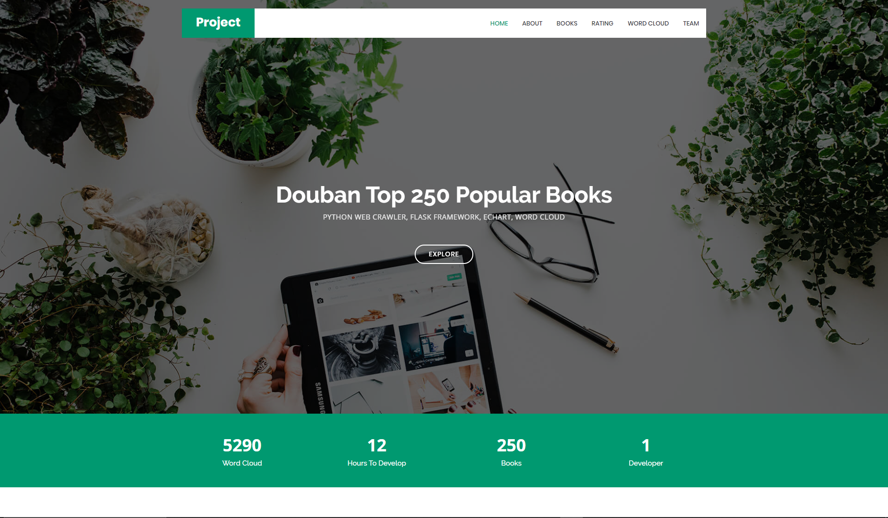
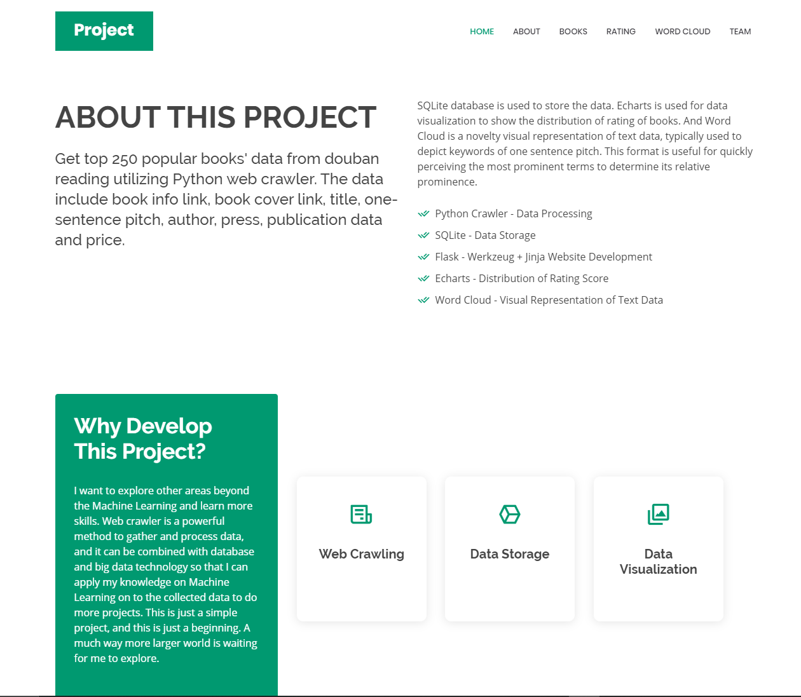
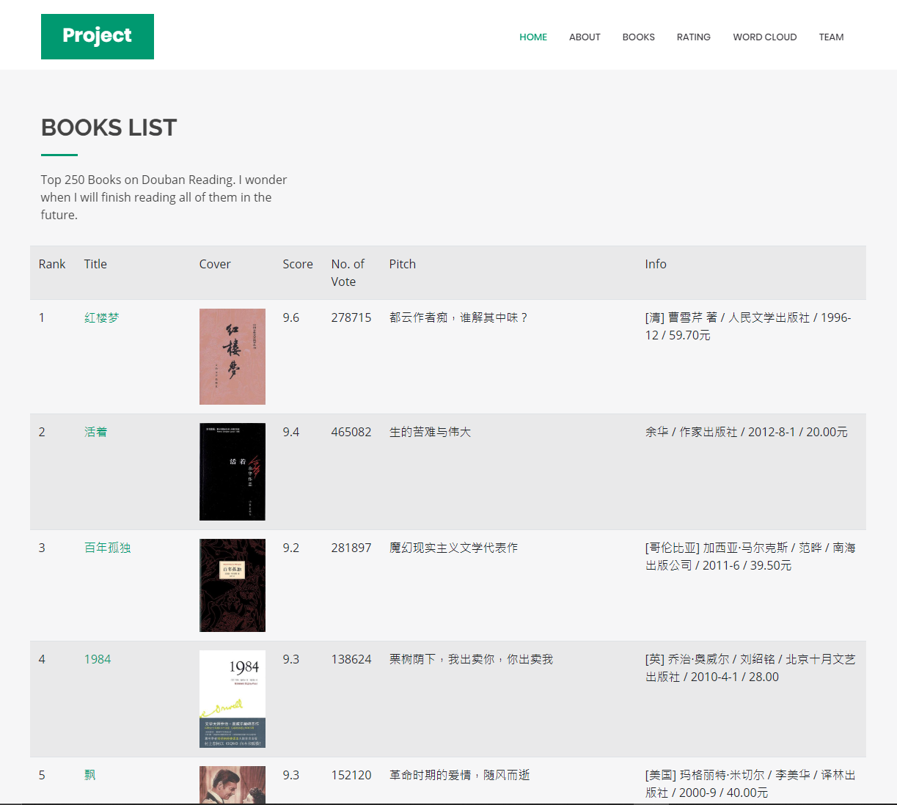
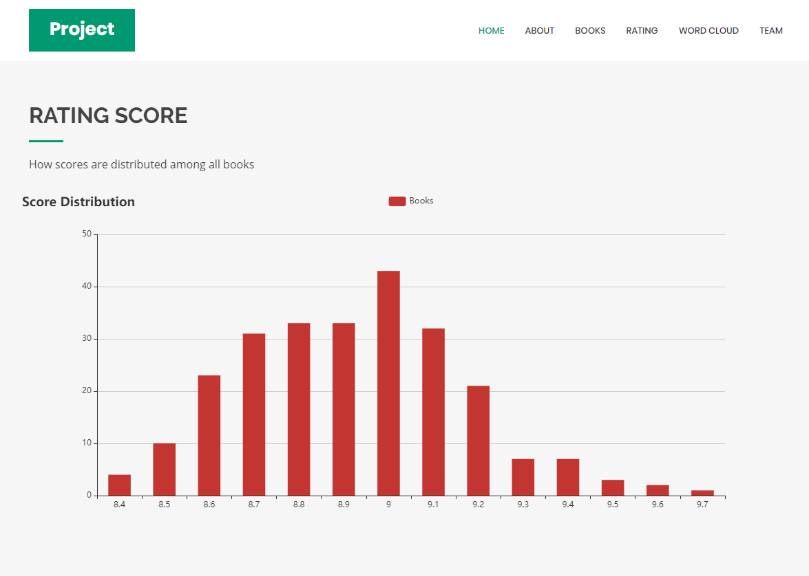
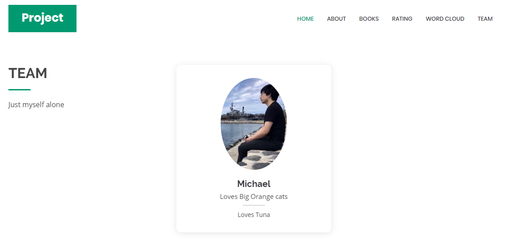

# Project_Webcrawler_DoubanTop250Books
A simple web crawler to get top 250 popular books on douban reading.

- Web crawler
- Simple data storage
- Flask Framework
- EChart data visualiation
- Word Cloud

## Screen Shot of the finished simple website

Home Page

About Page

Books Page

Score Distribution Page

Team Page

## Data Collection and Storage
The data contain titles, covers, scores, number of voters, authors, presses, prices and links of the books.

The data is stored in SQLite database.

## Website Development
Web Page Template:

Template Name: Bethany

Template URL: https://bootstrapmade.com/bethany-free-onepage-bootstrap-theme/

Author: BootstrapMade.com

License: https://bootstrapmade.com/license/

## Flask Framework
- Werkzeug for handling route
- Jinja for rendering template

## Echarts
Echarts is used to display the distribution of books at each different. [Click here to Official Site](https://www.echartsjs.com/en/index.html)

## Word Cloud
You can customize your own word cloud with your own text data by using this library. [Click here for more information](https://amueller.github.io/word_cloud/)

